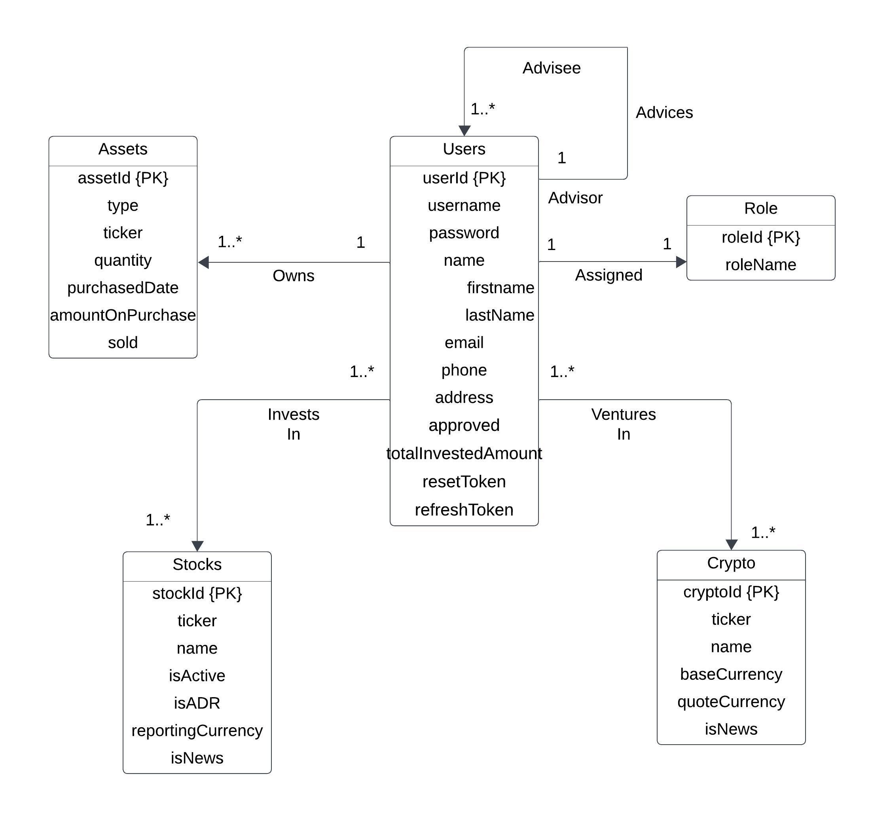

# AssetBlend Backend

AssetBlend Backend is a scalable and efficient server-side application built with Node.js, designed to support the AssetBlend Portfolio Tracker. It leverages CQRS architecture and Gateway design patterns to manage real-time data across 100+ assets.

## 🚀 Features

- **CQRS Architecture**: Separation of command and query responsibilities for improved performance and scalability
- **Gateway Design**: Efficient routing and request handling
- **Real-time Data Management**: Integration with Tingo APIs for up-to-date stock and crypto information
- **Efficient Data Computation**: Utilizes MongoDB's aggregation framework
- **Role-based Access Control**: Supports Guest, Registered User, Financial Advisor, and Admin roles

## 🛠️ Tech Stack

- Node.js
- Express.js
- MongoDB
- Mongoose
- Tingo API integration

## 🚦 Getting Started

1. Clone the repository and navigate to the source.

2. Install dependencies:
   ```
   npm install
   ```

3. Set up environment variables:
   Create a `.env` file in the root directory and add:
   ```
    PORT=3000
    MONGO_URL=Your mongo url
    JWT_SECRET=your jwt secret
    TIINGO_BASE_URL=tingo base url
    API_TOKEN=Tiingo api token
   ```

4. Start the server:
   ```
   npm start
   ```

## 🔐 API Endpoints

For a detailed list of available API endpoints and their descriptions, please refer to the [API Endpoints Documentation]([./API_ENDPOINTS.md](https://github.com/gsakshay/assetBlend-backend/blob/main/API_Endpoints.md).

## 🚀 Scaling Considerations

- **CQRS**: Separate models for read and write operations
- **Load Balancing**: Prepare for horizontal scaling with load balancers

## 📦 Database

